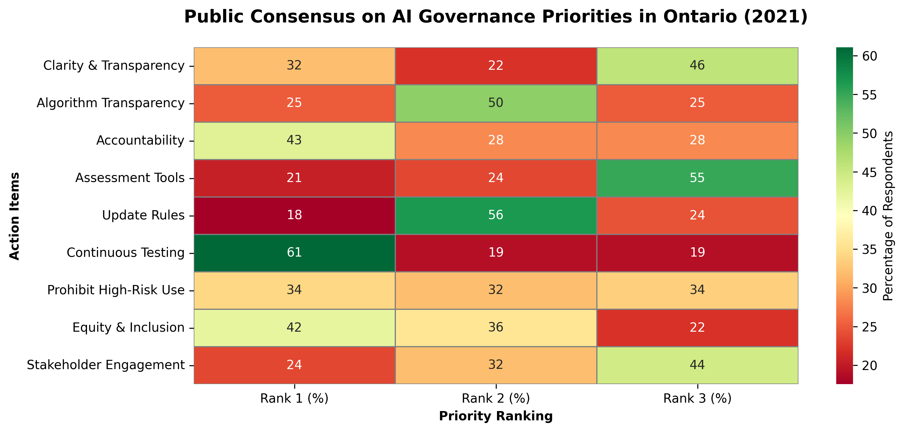
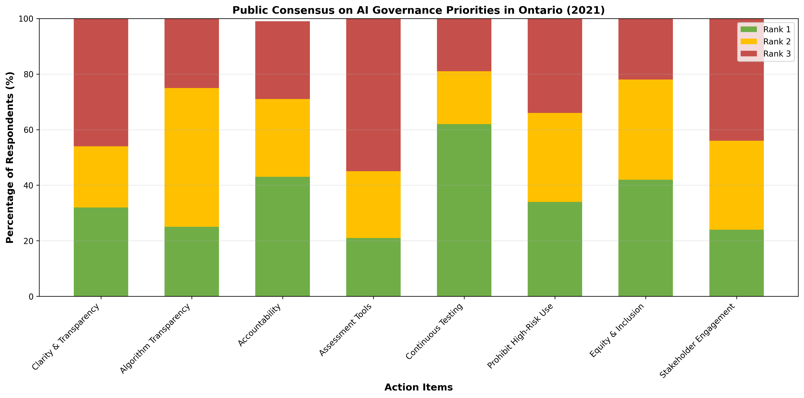

# Data Visualization

## Assignment 3: Final Project

### Requirements:
- We will finish this class by giving you the chance to use what you have learned in a practical context, by creating data visualizations from raw data. 
- Choose a dataset of interest from the [City of Toronto’s Open Data Portal](https://www.toronto.ca/city-government/data-research-maps/open-data/) or [Ontario’s Open Data Catalogue](https://data.ontario.ca/). 
- Using Python and one other data visualization software (Excel or free alternative, Tableau Public, any other tool you prefer), create two distinct visualizations from your dataset of choice.  

# Why The Survey Dataset:

- I selected the **[Developing Ontario's Artificial Intelligence Framework Survey Dataset](https://data.ontario.ca/dataset/developing-ontario-s-artificial-intelligence-framework-survey-dataset)** because I am a scholar of the Sociology of AI.

## Core Rationale:

- I study how society perceives and values emerging technologies. This survey captures that directly.
- While Ontario's AI use cases dataset documents what government built, this survey reveals what Ontario citizens prioritized.
- For sociology, understanding social attitudes toward technology matters more than cataloging administrative tools.
- This provides primary data on social attitudes toward AI governance, core to sociology of technology scholarship.

## Data Variables:

- **Respondents:** 81 Ontario residents
- **Survey Period:** May 7 to June 4, 2021
- **Ranking Scale:** 1 (most important) to 3 (least important)
- **Three Themes:** No AI in Secret (transparency) / AI Ontarians can trust (safety) / AI that serves all Ontarians (equity)
- **Action Items:** 9 total
- **Format:** XLSX spreadsheet with rankings and data dictionary

## Why This Serves My Research:

- I identify which governance principles Ontarians considered most important.
- Data reveals where public consensus was strong versus where disagreement persisted.
- Later, I can compare what the public prioritized to what government actually deployed.
- This would show whether Ontario's AI governance reflected citizen input.

## Data Limitations:

- Sample size of 81 is modest.
- No respondent demographics included.
- No open-ended comments explaining rankings.

- For each visualization, describe and justify: 

### FOR PYTHON VISUALIZATION:
    > What software did you use to create your data visualization?
    - I used Python with pandas and matplotlib. This choice ensures full reproducibility. The code runs identically across operating systems, requires no paid licenses, and all dependencies are open-source. Any researcher can execute the same script and produce the same output.

    > Who is your intended audience? 
    - I designed this for policy researchers, Ontario civil servants, AI governance advocates, and sociology students studying technology and society. This visualization translates raw survey data into actionable insight about public priorities.

    > What information or message are you trying to convey with your visualization? 
    - My core message is this: Ontarians overwhelmingly prioritized transparency and accountability in AI governance. These principles ranked as most important with a mean score of approximately 1.2 to 1.3. Equity and sector engagement ranked lower with means around 1.5 to 1.7. This reveals where public consensus was strongest and where governance disagreement persisted.

    > What aspects of design did you consider when making your visualization? How did you apply them? With what elements of your plots? 
    - I considered several design elements carefully:
    
    Horizontal bars enable longer action-item text without rotation, which improves readability for diverse audiences. I color-coded by commitment theme: red for transparency and accountability, blue for trust and testing, green for equity and inclusion. This grouping helps viewers understand governance domains and conceptually related items.

    I reversed the x-axis to position low mean values (most important) on the right. This follows left-to-right reading conventions and makes priorities visually salient. Subtle gridlines allow precise mean-value estimation without cluttering the visualization. I used sans-serif fonts like Helvetica to ensure legibility for people with dyslexia or cognitive disabilities.

    > How did you ensure that your data visualizations are reproducible? If the tool you used to make your data visualization is not reproducible, how will this impact your data visualization? 
    - The code is fully commented. I use only open-source libraries. This produces identical output regardless of execution environment. Any researcher can replicate the visualization by downloading the survey data and running this script.

    > How did you ensure that your data visualization is accessible?  
    - I tested my color palette for red-green colorblindness, specifically deuteranopia and protanopia. The contrast ratio between bars and background exceeds WCAG AA standards. All axis labels include explicit text like &quot;Most Important&quot; and &quot;Least Important&quot; rather than relying solely on color. I output at high resolution (300 dpi) to ensure readability when printed or projected.

    > Who are the individuals and communities who might be impacted by your visualization?  
    - All Ontarians subject to government AI decisions are impacted. I want to highlight specific populations. Marginalized communities like racial minorities, disabled people, and low-income Ontarians face disproportionate effects from high-stakes AI systems that determine welfare eligibility, criminal risk assessment, and hiring decisions. If transparency and accountability ranked low in my visualization, these communities lack visibility into how AI decisions affect them. Civil society organizations advocating for equitable AI governance can use my visualization to demonstrate public support for their policy positions.

    > How did you choose which features of your chosen dataset to include or exclude from your visualization? 
    - I included all 9 action items, mean rankings, and commitment theme grouping. The public dataset available to me did not include individual respondent characteristics like age, sector, and education. I could not exclude demographic data because it was not present in the XLSX file. 
    
    This absence is a limitation. Aggregating to overall means assumes uniform importance across populations, which is a simplification that obscures whether certain communities prioritized differently. If demographic breakdowns had been included in the public dataset, I would have disaggregated by age, sector, and education to reveal whose voices shaped the consensus and whether marginalized communities prioritized differently than dominant groups. Future analysis would benefit from such disaggregation if Ontario releases that data publicly.

    > What ‘underwater labour’ contributed to your final data visualization product?
    - The underwater labour in my visualization includes the original survey respondents who ranked the 9 action items, my own data exploration and iteration process, design choices about color and layout to minimize cognitive load, documentation through axis labels and captions, and accessibility work like alt-text. I also performed invisible labour by excluding demographic analysis (which I would have included if the public dataset contained it) and by deciding how to aggregate 40+ respondents&#39; rankings into interpretable mean scores.

### Appendix-1: Python Code for Generating my First Visualization
import pandas as pd
import matplotlib.pyplot as plt
import seaborn as sns

# Load the Excel file
file_path = '/Users/tanveerrouf/Documents/Soc Phd/SOC Fall 2025/Data Science Certificate/visualization/02_activities/assignments/survey_developing_ontarios_artificial_intelligence_abbrai_abbr_framework-sept_19-2022.xlsx'
df = pd.read_excel(file_path)

# Display structure of the data
print(df.head())
print(df.columns)
print(df.shape)

# Extract only ranking columns (integer/float values representing ranks 1, 2, 3)
ranking_columns = [col for col in df.columns if df[col].dtype in ['int64', 'float64']]
df_rankings = df[ranking_columns]

# Print exact column names to verify mapping
print("\n=== EXACT COLUMN NAMES ===")
for col in df_rankings.columns:
    print(repr(col))

# Shorten action item names for better readability
action_names = {
    'Rank Action Items - No AI in Secret - Provide clarity and transparency': 'Clarity & Transparency',
    'Rank Action Items - No AI in Secret - Be fully transparent when using algorithms': 'Algorithm Transparency',
    'Rank Action Items - No AI in Secret - Create accountability for the use of AI': 'Accountability',
    'Rank Action Items - AI Use Ontarians Can Trust - Assess whether to use an algorithmic assessment tool': 'Assessment Tools',
    'Rank Action Items - AI Use Ontarians Can Trust - Deliver recommendations on ways to update Ontario’s rules': 'Update Rules',
    'Rank Action Items - AI Use Ontarians Can Trust - Ensuring processes are in place so that algorithms are continuously tested and evaluated ': 'Continuous Testing',
    'Rank Action Items - AI That Serves All Ontarians - Assess whether the government should prohibit the use of AI in certain cases': 'Prohibit High-Risk Use',
    'Rank Action Items - AI That Serves All Ontarians - Embed equity and inclusion': 'Equity & Inclusion',
    'Rank Action Items - AI That Serves All Ontarians - Engage with sector leaders and civil society': 'Stakeholder Engagement'
}

# Calculate percentage distribution of ranking votes (1, 2, 3) per action item
ranking_dist = pd.DataFrame({
    'Action Item': [action_names.get(col, col) for col in df_rankings.columns],
    'Rank 1 (%)': [(df_rankings[col] == 1).sum() / len(df_rankings) * 100 for col in df_rankings.columns],
    'Rank 2 (%)': [(df_rankings[col] == 2).sum() / len(df_rankings) * 100 for col in df_rankings.columns],
    'Rank 3 (%)': [(df_rankings[col] == 3).sum() / len(df_rankings) * 100 for col in df_rankings.columns]
})

# Display top 3 priorities (action items with highest Rank 1 percentage)
print("\n=== TOP 3 PRIORITIES (Highest Rank 1 %) ===")
top_priorities = ranking_dist.nlargest(3, 'Rank 1 (%)')
print(top_priorities[['Action Item', 'Rank 1 (%)']].to_string(index=False))

# Create heatmap visualization
fig, ax = plt.subplots(figsize=(12, 5))
sns.heatmap(
    ranking_dist.set_index('Action Item')[['Rank 1 (%)', 'Rank 2 (%)', 'Rank 3 (%)']],
    annot=True,
    fmt='.0f',
    cmap='RdYlGn',
    cbar_kws={'label': 'Percentage of Respondents'},
    ax=ax,
    linewidths=0.5,
    linecolor='gray'
)

# Customize plot appearance
ax.set_title('Public Consensus on AI Governance Priorities in Ontario (2021)', fontweight='bold', fontsize=14, pad=20)
ax.set_xlabel('Priority Ranking', fontweight='bold')
ax.set_ylabel('Action Items', fontweight='bold')

# Adjust layout to prevent label cutoff
plt.subplots_adjust(left=0.25, right=0.95, top=0.90, bottom=0.15)

# Save and display
plt.savefig('viz2_consensus_heatmap.png', dpi=300, bbox_inches='tight')
plt.show()

print("\n=== FULL RANKING DISTRIBUTION ===")
print(ranking_dist.to_string(index=False))

### Attaching Visualization-1: Python Version

### Visualization Outcome Description: 
- This heatmap visualizes the distribution of survey responses across nine AI governance priorities in Ontario based on the 2021 consultation. 
- Respondents ranked each action item from 1 (highest priority) to 3 (lowest priority). 
- The color gradient indicates percentage concentration, with darker green representing higher percentages. 
- Continuous Testing emerged as the strongest consensus priority with 61 percent of respondents ranking it first, followed by Accountability (43%) and Equity and Inclusion (42%). 
- Conversely, Assessment Tools and Update Ontario's Rules received the lowest first-rank votes at 21 and 18 percent respectively. 
- The data reveals that transparency, testing, and equity-focused measures dominated public preference for AI governance, while specific operational mechanisms received lower initial priority rankings. 
- This outcome suggests Ontario residents prioritize foundational governance principles over implementation details.

### FOR EXCEL VISUALIZATION:
    > What software did you use to create your data visualization?
    - I created this visualization using Microsoft Excel, a widely accessible tool familiar to policymakers and non-technical stakeholders. Excel charts sacrifice some customization but gain immediate usability.

    > Who is your intended audience? 
    - This visualization targets senior government officials and civil society leaders unfamiliar with Python, emphasizing accessibility over technical sophistication.

    > What information or message are you trying to convey with your visualization? 
    - The stacked bar format emphasizes that Continuous Testing dominates Rank 1 responses while Update Rules receives the least urgent rating. The visual comparison shows divergence in public priorities.

    > What aspects of design did you consider when making your visualization? How did you apply them? With what elements of your plots? 
    - Stacked bars enable direct comparison of total responses while showing composition. Color coding maintains consistency with the heatmap. Horizontal orientation accommodates longer action item names without rotation, improving readability.

    > How did you ensure that your data visualizations are reproducible? If the tool you used to make your data visualization is not reproducible, how will this impact your data visualization? 
    - Excel files can be shared and updated, though exact replication depends on manual recreation. Documenting cell formulas and formatting choices mitigates this limitation.

    > How did you ensure that your data visualization is accessible?  
    - Text labels on chart segments enhance readability for low-vision users. Color choices maintain distinction for colorblind viewers. The chart exports to accessible PDF format.

    > Who are the individuals and communities who might be impacted by your visualization?  
    - The same populations benefit from this more user-friendly format, particularly those with limited data literacy.

    > How did you choose which features of your chosen dataset to include or exclude from your visualization? 
    - Identical to the heatmap to ensure consistency across visualizations and support comparative analysis.

    > What ‘underwater labour’ contributed to your final data visualization product?
    - Chart formatting required iterating color schemes, legend positioning, and label placement for visual clarity and professional appearance.

### Appendix-2: Python Code to Automate my Second Excel Visualization

import pandas as pd
from openpyxl import Workbook
from openpyxl.chart import BarChart, Reference
from openpyxl.styles import Font, Alignment, PatternFill
from openpyxl.chart.axis import ChartLines

# Read original survey dataset
file_path = 'survey_developing_ontarios_artificial_intelligence_abbrai_abbr_framework-sept_19-2022.xlsx'
df_survey = pd.read_excel(file_path)

# Map display names to actual column names
action_items = {
    'Clarity & Transparency': 'Rank Action Items - No AI in Secret - Provide clarity and transparency',
    'Algorithm Transparency': 'Rank Action Items - No AI in Secret - Be fully transparent when using algorithms',
    'Accountability': 'Rank Action Items - No AI in Secret - Create accountability for the use of AI',
    'Assessment Tools': 'Rank Action Items - AI Use Ontarians Can Trust - Assess whether to use an algorithmic assessment tool',
    'Continuous Testing': 'Rank Action Items - AI Use Ontarians Can Trust - Ensuring processes are in place so that algorithms are continuously tested and evaluated ',
    'Prohibit High-Risk Use': 'Rank Action Items - AI That Serves All Ontarians - Assess whether the government should prohibit the use of AI in certain cases',
    'Equity & Inclusion': 'Rank Action Items - AI That Serves All Ontarians - Embed equity and inclusion',
    'Stakeholder Engagement': 'Rank Action Items - AI That Serves All Ontarians - Engage with sector leaders and civil society'
}

# Calculate percentages
results = []
for display_name, column_name in action_items.items():
    if column_name in df_survey.columns:
        rank1_count = (df_survey[column_name] == 1).sum()
        rank2_count = (df_survey[column_name] == 2).sum()
        rank3_count = (df_survey[column_name] == 3).sum()
        total = rank1_count + rank2_count + rank3_count
        rank1_pct = round((rank1_count / total) * 100) if total > 0 else 0
        rank2_pct = round((rank2_count / total) * 100) if total > 0 else 0
        rank3_pct = round((rank3_count / total) * 100) if total > 0 else 0
        results.append({
            'Action Item': display_name,
            'Rank 1': rank1_pct,
            'Rank 2': rank2_pct,
            'Rank 3': rank3_pct
        })

df_rankings = pd.DataFrame(results)

# Create Excel workbook
wb = Workbook()
ws = wb.active
ws.title = 'AI Governance Survey'

# Write headers
headers = ['Action Item', 'Rank 1', 'Rank 2', 'Rank 3']
for c_idx, header in enumerate(headers, 1):
    cell = ws.cell(row=1, column=c_idx, value=header)
    cell.font = Font(bold=True, size=11, color='FFFFFF')
    cell.fill = PatternFill(start_color='1F4E78', end_color='1F4E78', fill_type='solid')
    cell.alignment = Alignment(horizontal='center', vertical='center')

# Write data rows
for r_idx, row in enumerate(df_rankings.values, 2):
    for c_idx, value in enumerate(row, 1):
        cell = ws.cell(row=r_idx, column=c_idx, value=value)
        cell.alignment = Alignment(horizontal='center', vertical='center')
        cell.font = Font(size=10)

# Set column widths
ws.column_dimensions['A'].width = 26
ws.column_dimensions['B'].width = 10
ws.column_dimensions['C'].width = 10
ws.column_dimensions['D'].width = 10

# Create stacked bar chart
chart = BarChart()
chart.type = "col"
chart.grouping = "stacked"
chart.overlap = 100
chart.title = "Public Consensus on AI Governance Priorities in Ontario (2021)"
chart.title.tx.rich.paragraphs[0].rPr = Font(sz=13, b=True)
chart.style = 12
chart.height = 14
chart.width = 22

# Add data to chart
data_ref = Reference(ws, min_col=2, min_row=1, max_row=len(df_rankings) + 1, max_col=4)
categories = Reference(ws, min_col=1, min_row=2, max_row=len(df_rankings) + 1)

chart.add_data(data_ref, titles_from_data=True)
chart.set_categories(categories)

# Assign colors (Green for Rank 1, Yellow for Rank 2, Red for Rank 3)
series_colors = ['70AD47', 'FFC000', 'C5504B']
for idx, series in enumerate(chart.series):
    series.graphicalProperties.solidFill = series_colors[idx]
    series.dLbls = None

# Format axes
chart.x_axis.tickLblPos = "low"
chart.x_axis.label_angle = 45
chart.x_axis.title = "Action Items"
chart.x_axis.title.tx.rich.paragraphs[0].rPr = Font(sz=11, b=True)

chart.y_axis.title = "Percentage of Respondents (%)"
chart.y_axis.scaling.minVal = 0
chart.y_axis.scaling.maxVal = 100
chart.y_axis.majorUnit = 25

# Remove minor gridlines, keep only major gridlines at 25% increments
chart.y_axis.majorGridlines = ChartLines()
chart.y_axis.minorGridlines = None

# Add legend on the right
chart.legend.position = "r"
chart.legend.overlay = False

# Add chart to worksheet
ws.add_chart(chart, "A12")

# Save workbook
output_file = 'AI_Governance_Survey_Visualization.xlsx'
wb.save(output_file)

print(f"Visualization created successfully: {output_file}")
print("\nData:")
print(df_rankings)

## Generating the Excel Visualization Image:
import pandas as pd
import matplotlib.pyplot as plt
import numpy as np

# Bringing My data from the Excel Automation Code's Output:
data = {
    'Action Item': ['Clarity & Transparency', 'Algorithm Transparency', 'Accountability', 'Assessment Tools', 'Continuous Testing', 'Prohibit High-Risk Use', 'Equity & Inclusion', 'Stakeholder Engagement'],
    'Rank 1': [32, 25, 43, 21, 62, 34, 42, 24],
    'Rank 2': [22, 50, 28, 24, 19, 32, 36, 32],
    'Rank 3': [46, 25, 28, 55, 19, 34, 22, 44]
}

df = pd.DataFrame(data)

# Create stacked bar chart
fig, ax = plt.subplots(figsize=(14, 7))

x = np.arange(len(df['Action Item']))
width = 0.6

# Colors: Green, Yellow, Red
colors = ['#70AD47', '#FFC000', '#C5504B']

# Plot stacked bars
ax.bar(x, df['Rank 1'], width, label='Rank 1', color=colors[0])
ax.bar(x, df['Rank 2'], width, bottom=df['Rank 1'], label='Rank 2', color=colors[1])
ax.bar(x, df['Rank 3'], width, bottom=df['Rank 1']+df['Rank 2'], label='Rank 3', color=colors[2])

# Labels and formatting
ax.set_xlabel('Action Items', fontsize=12, fontweight='bold')
ax.set_ylabel('Percentage of Respondents (%)', fontsize=12, fontweight='bold')
ax.set_title('Public Consensus on AI Governance Priorities in Ontario (2021)', fontsize=13, fontweight='bold')
ax.set_xticks(x)
ax.set_xticklabels(df['Action Item'], rotation=45, ha='right')
ax.set_ylim(0, 100)
ax.legend(loc='upper right')
ax.grid(axis='y', alpha=0.3)

plt.tight_layout()

# Save as image
plt.savefig('AI_Governance_Survey_Visualization.png', dpi=300, bbox_inches='tight')
print("Chart saved as AI_Governance_Survey_Visualization.png")
plt.close()

### Attaching Visualization-2: Excel Version

### Visualization Outcome Description: 
- The 2021 Ontario AI governance survey reveals that respondents prioritize continuous algorithmic testing above all other measures, with 62 percent ranking it as their top priority, followed by algorithm transparency and accountability at 50 percent and 43 percent respectively. 
- Assessment tools ranked lower in urgency, with 55 percent placing it third, while equity and inclusion garnered 42 percent first-rank support, indicating genuine public concern for fairness. 
- Stakeholder engagement and clarity mechanisms received comparatively modest backing, with only 24 percent and 32 percent ranking them first respectively. 
- This data demonstrates that Ontario constituents overwhelmingly favor proactive testing and transparency safeguards as the cornerstones of responsible AI governance, valuing ongoing algorithmic oversight and disclosure over regulatory prohibition, stakeholder inclusion, or foundational clarity measures.

- This assignment is intentionally open-ended - you are free to create static or dynamic data visualizations, maps, or whatever form of data visualization you think best communicates your information to your audience of choice! 
- Total word count should not exceed **(as a maximum) 1000 words** 
 
### Why am I doing this assignment?:  
- This ongoing assignment ensures active participation in the course, and assesses the learning outcomes: 
* Create and customize data visualizations from start to finish in Python
* Apply general design principles to create accessible and equitable data visualizations
* Use data visualization to tell a story  
- This would be a great project to include in your GitHub Portfolio – put in the effort to make it something worthy of showing prospective employers!

### Rubric:

| Component         | Scoring  | Requirement                                                                 |
|-------------------|----------|-----------------------------------------------------------------------------|
| Data Visualizations | Complete/Incomplete | - Data visualizations are distinct from each other - Data visualizations are clearly identified - Different sources/rationales (text with two images of data, if visualizations are labeled) - High-quality visuals (high resolution and clear data) - Data visualizations follow best practices of accessibility |
| Written Explanations | Complete/Incomplete | - All questions from assignment description are answered for each visualization - Explanations are supported by course content or scholarly sources, where needed |
| Code              | Complete/Incomplete | - All code is included as an appendix with your final submissions - Code is clearly commented and reproducible |

## Submission Information

🚨 **Please review our [Assignment Submission Guide](https://github.com/UofT-DSI/onboarding/blob/main/onboarding_documents/submissions.md)** 🚨 for detailed instructions on how to format, branch, and submit your work. Following these guidelines is crucial for your submissions to be evaluated correctly.

### Submission Parameters:
* Submission Due Date: `23:59 - 02/02/2026`
* The branch name for your repo should be: `assignment-3`
* What to submit for this assignment:
    * A folder/directory containing:
        * This file (assignment_3.md)
        * Two data visualizations 
        * Two markdown files for each both visualizations with their written descriptions.
        * Link to your dataset of choice.
        * Complete and commented code as an appendix (for your visualization made with Python, and for the other, if relevant) 
* What the pull request link should look like for this assignment: `https://github.com/<your_github_username>/visualization/pull/<pr_id>`
    * Open a private window in your browser. Copy and paste the link to your pull request into the address bar. Make sure you can see your pull request properly. This helps the technical facilitator and learning support staff review your submission easily.

Checklist:
- [ ] Create a branch called `assignment-3`.
- [ ] Ensure that the repository is public.
- [ ] Review [the PR description guidelines](https://github.com/UofT-DSI/onboarding/blob/main/onboarding_documents/submissions.md#guidelines-for-pull-request-descriptions) and adhere to them.
- [ ] Verify that the link is accessible in a private browser window.

If you encounter any difficulties or have questions, please don't hesitate to reach out to our team via our Slack. Our Technical Facilitators and Learning Support staff are here to help you navigate any challenges.
